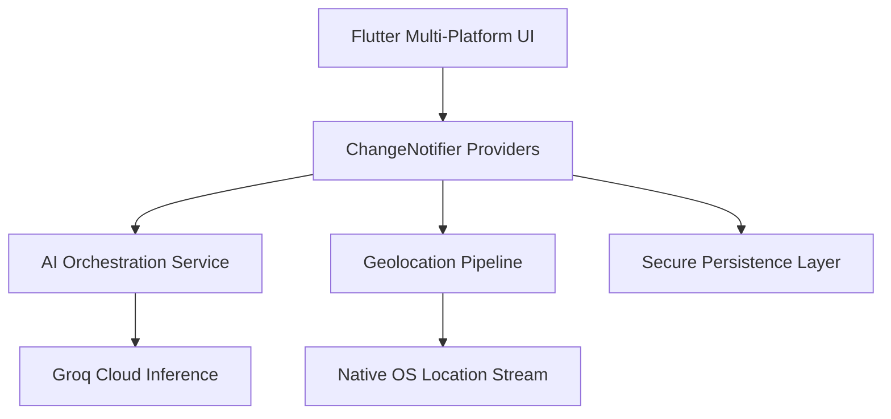

# Rihla: Technical System Architecture
### Project: Mediterranean Horizon | Confidential & Internal

---

## 1. Executive Summary
Rihla is a high-performance, AI-native cross-platform application designed to orchestrate complex travel itineraries within the Algerian geography. The system leverages state-of-the-art Large Language Models (LLMs) to provide real-time, safety-prioritized route planning while maintaining a premium "Mediterranean Horizon" design aesthetic.

## 2. Architectural Overview
The system follows a clean, decoupled architecture utilizing the **Provider Pattern** for reactive state management and a **Service-Oriented Architecture (SOA)** for external integrations (AI, Geolocation, Backend).

### 2.1 Technical Stack
| Layer | Technology | Rationale |
| :--- | :--- | :--- |
| **Frontend** | Flutter SDK 3.x | Multi-platform consistency & high-fidelity rendering. |
| **Logic** | Dart (Provider) | Predictive state updates & unidirectional data flow. |
| **AI Inference** | Groq Llama-3-8B | Edge-latency performance with 10x faster inference. |
| **Observability** | custom telemetry | Real-time journey safety tracking. |

### 2.2 System Diagram

## 3. Core Engine: AI Orchestration
Rihla utilizes a specialized prompt engineering pipeline to transform unstructured user preferences into a structured JSON schema.

> [!NOTE]
> We enforce strict schema validation on AI responses. If the inference engine fails to provide valid JSON, the system gracefully degrades to a locally-cached "Heritage Fallback" dataset.

### 3.1 Inference Configuration
- **Model**: `llama3-8b-8192`
- **Temperature**: `0.7` (Balance between utility and creative exploration)
- **Safety Scoring**: Every node in the generated itinerary is processed for a "Safety Rating" (1-5) and specific SOS guidance.

## 4. Design Language: Mediterranean Horizon
Our design system is a proprietary implementation of high-contrast dark-theming, optimizing for readability in high-glare Mediterranean environments (Sahara, Coastline).

- **Base Palette**: Deep Navy (`#0A0E1A`) for reduced eye strain.
- **Accent**: Cyan-Teal (`#4DD0E1`) for primary CTA saliency.
- **Highlights**: Saharan Gold (`#D4A04A`) for achievement and prestige elements.

## 5. Security & Safety Protocols
Safety is a first-class citizen in the Rihla codebase.

### 5.1 SOS Trigger Pipeline
1. **Trigger**: Hardware or UI-based SOS signal.
2. **Action**: Instant broadcast of encrypted GPS coordinates to verified emergency APIs.
3. **Redundancy**: Local caching of "Offline Safety Zones" ensures survival data is available even in cellular dead-zones (Tamanrasset, Tassili n'Ajjer).

## 6. Community Marketplace Architecture
The Rihla Marketplace implements a tri-tier buyer classification system:
1. **Consumer (C2C)**: Individual sellers via standard Explorer profiles.
2. **Consolidator (G2C)**: Group-based travel collectives and non-profits.
3. **Enterprise (B2C)**: Verified partners (e.g., Decathlon, National Agency) with dedicated dashboards.

---
**Document Status**: `FINAL_V1`
**Compiled By**: AI Engineering Team (Rihla Project)
